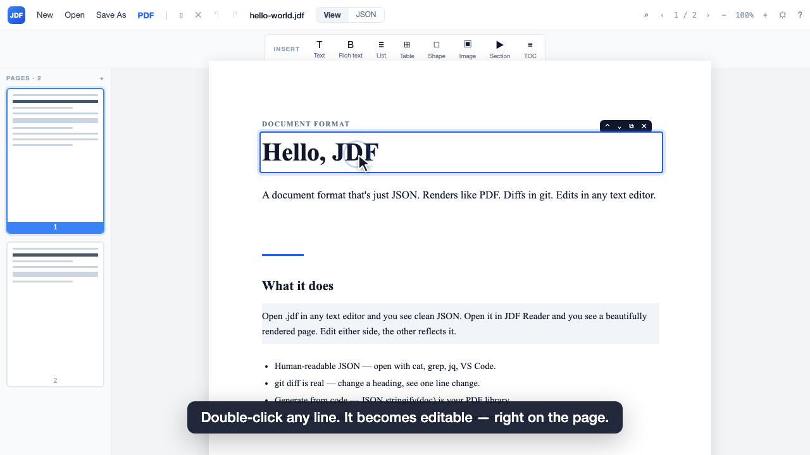
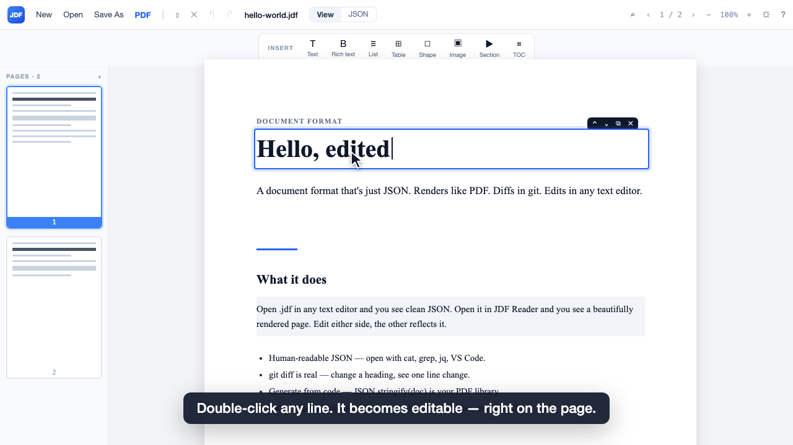
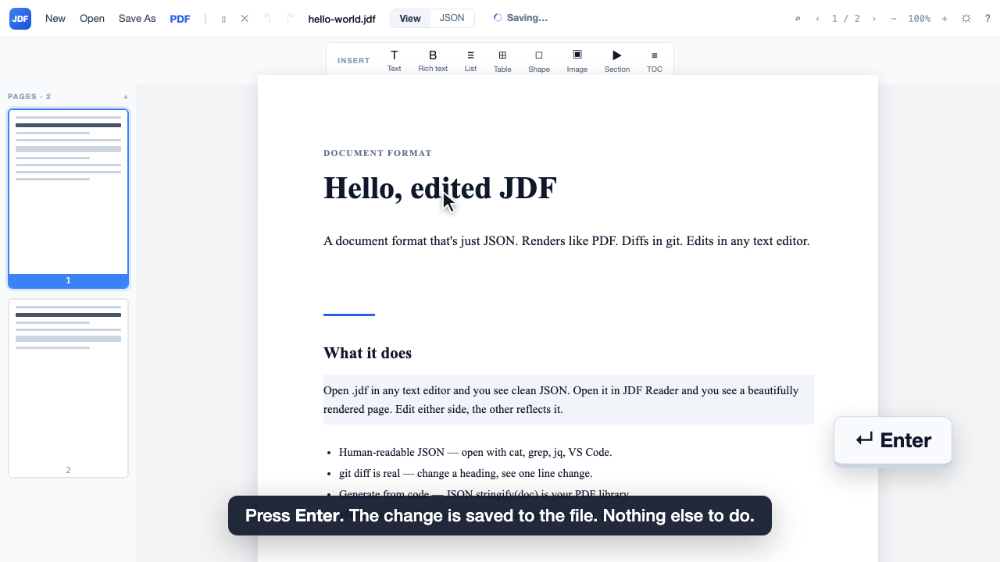
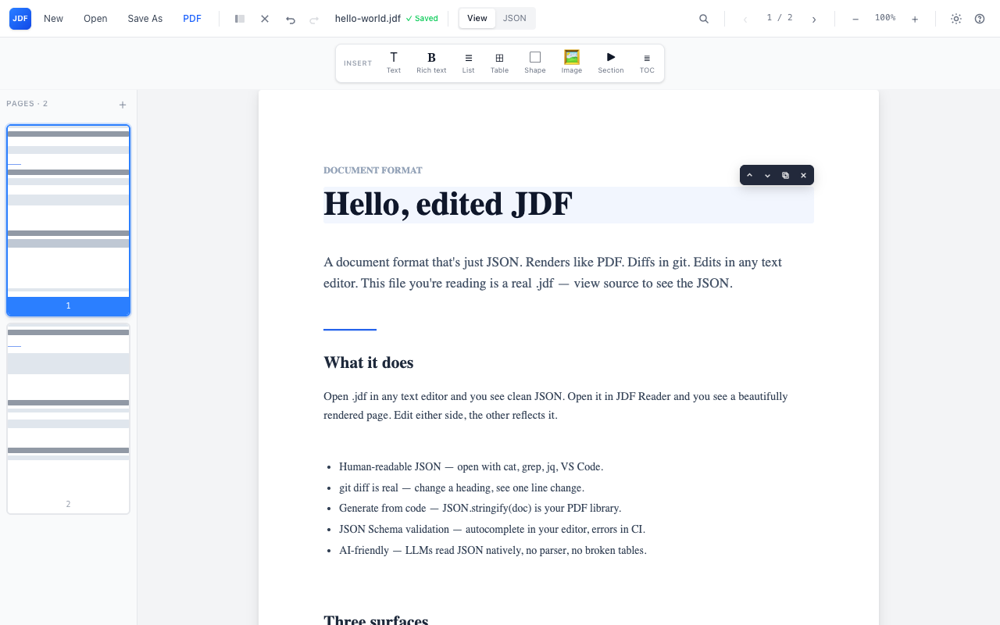

# Edit-in-place demo

**Video:** [`edit-in-place.mp4`](edit-in-place.mp4) — 1280×720, 30 fps, 17 s, H.264.

The reader opens `hello-world.jdf`, the user double-clicks the heading, types a new title and presses **Enter**; the toolbar flashes *Saving… → Saved*. A second edit is committed by clicking somewhere else. Outro card.

| | |
|---|---|
|  |  |
|  |  — the real app after the same edit |

## Is that really how the app behaves?

Yes — `verify/verify-edit.mjs` drives the actual reader frontend (`apps/reader`, served by Vite) in Google Chrome through Playwright, with the Tauri IPC bridge replaced by an in-page mock that serves the fixture and records `save_document` calls. It asserts:

1. opening from **Recent Files** reads the file (`read_text_file`) and renders the page
2. **double-click** on a line opens a focused inline editor
3. **Enter** commits the edit and autosaves the whole document to the opened path
4. **clicking elsewhere** (blur) commits + autosaves too
5. **Escape** cancels without saving

[`verify-real-app.webm`](verify-real-app.webm) is the recording of that run.

```bash
pnpm --filter @jdf/demo-edit-in-place verify   # runs the Playwright check (needs Google Chrome)
pnpm --filter @jdf/demo-edit-in-place studio   # Remotion studio — tweak the composition live
pnpm --filter @jdf/demo-edit-in-place render   # → out/edit-in-place.mp4
```

The composition (`src/EditInPlace.tsx`) is a faithful React mock of the reader UI (toolbar, insert bar, page sidebar, page) with an animated cursor, click ripples, typing caret, Enter keycap and captions. Timings live in the `T` table at the top of the file.
