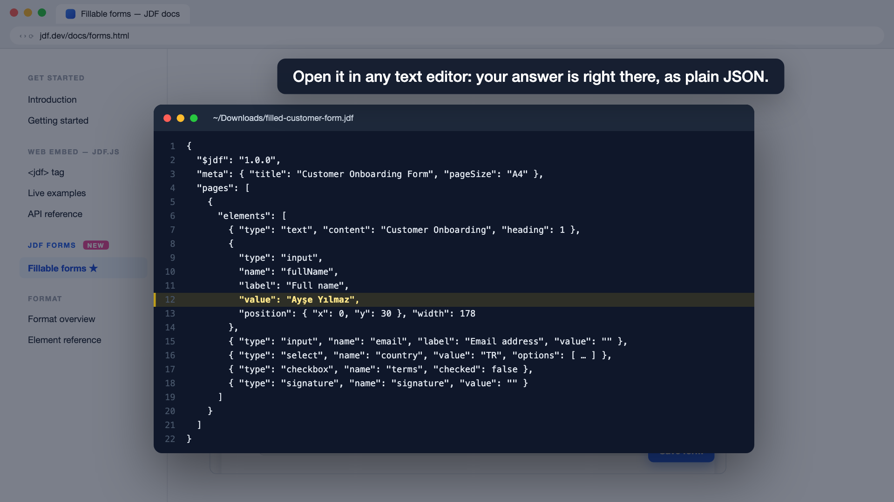
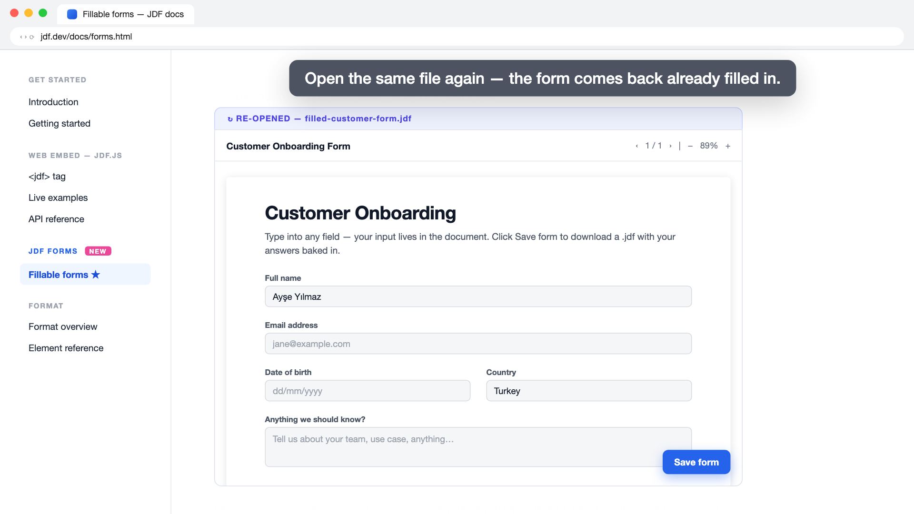

# Web form fill demo

**Video:** [`web-form-fill.mp4`](web-form-fill.mp4) — 1920×1080, 30 fps, 36 s, H.264.

A JDF form embedded in the docs page with a single `<jdf save-button>` tag. The visitor types a name into **Full name**, clicks **Save form**, the browser downloads `filled-customer-form.jdf`, and the file — opened in a text editor — carries `"value": "Ayşe Yılmaz"` next to the field. Re-opening the downloaded file shows the form already filled in.

| | |
|---|---|
|  |  |
|  |  |

## Is that really how it works?

Yes — `verify/verify-form.mjs` serves the real `docs/` site, loads `docs/forms.html` in Google Chrome through Playwright and:

1. waits for the `<jdf save-button>` embed to render `customer-form.jdf`
2. types the name into `input[name=fullName]`
3. clicks the real **Save form** button and captures the browser download
4. parses the downloaded `.jdf` and asserts `fullName.value` equals what was typed
5. loads that file into a fresh `<jdf>` element and asserts the input is pre-filled

Real page, after typing / after re-open:  

[`verify-real-embed.webm`](verify-real-embed.webm) is the recording of that run.

```bash
pnpm --filter @jdf/demo-web-form-fill verify   # Playwright check (needs Google Chrome + python3)
pnpm --filter @jdf/demo-web-form-fill studio   # Remotion studio
pnpm --filter @jdf/demo-web-form-fill render   # → out/web-form-fill.mp4
```

The composition (`src/WebFormFill.tsx`) is a React mock of the docs page + jdf.js embed, laid out on 1280×720 and rendered 1.5× (`src/Root.tsx`). Timings live in the `T` table.
